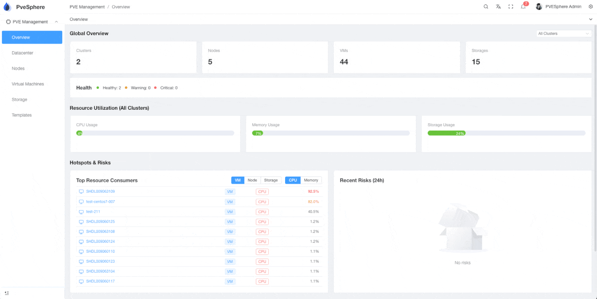

# pvesphere-enterprise
# PveSphere

[](LICENSE)

**English** | [中文](./README_zh.md)

---

## Introduction

PveSphere is a comprehensive web-based management platform for Proxmox VE (PVE) clusters. It provides a modern, intuitive interface for managing multiple PVE clusters, nodes, virtual machines, storage, and templates from a single unified dashboard.

 

### What is PveSphere?

PveSphere is a multi-cluster management solution that enables centralized control and monitoring of Proxmox VE infrastructure. It simplifies the complexity of managing distributed PVE environments by providing a single pane of glass for all your virtualization resources.

---

## Features

### 🎯 Core Functionality

- **Dashboard Overview**: Real-time monitoring of cluster resources, health status, and utilization metrics
- **Cluster Management**: Manage multiple PVE clusters with centralized authentication and configuration
- **Node Management**: Monitor and manage physical nodes across clusters, including console access
- **Virtual Machine Management**: Full lifecycle management of VMs including create, start, stop, migrate, backup, and restore
- **Storage Management**: Monitor storage usage, manage storage pools, and view storage content
- **Template Management**: Import, sync, and manage VM templates for rapid deployment

### 🚀 Key Capabilities

- Multi-cluster support with unified management interface
- Real-time resource monitoring and metrics visualization
- VM console access via VNC/NoVNC
- Node console access via terminal proxy
- Cloud-Init configuration support
- Automated template synchronization
- Backup and restore functionality
- Task monitoring and management
- Network configuration management
- Service management (start, stop, restart)
- Responsive design with mobile support
- Internationalization (i18n) support

---

## Technology Stack

### Frontend (`pvesphere-ui`)

- **Framework**: Vue 3 (Composition API)
- **Build Tool**: Vite 7
- **UI Library**: Element Plus 2
- **Language**: TypeScript 5
- **State Management**: Pinia 3
- **Routing**: Vue Router 4
- **Internationalization**: Vue I18n
- **Charts**: ECharts 6
- **Terminal**: xterm.js 5, noVNC
- **Styling**: Tailwind CSS 4, SCSS
- **Base Template**: [vue-pure-admin](https://github.com/pure-admin/vue-pure-admin)

### Backend (`pvesphere`)

- **Language**: Go 1.23
- **Web Framework**: Gin 1.10
- **ORM**: GORM 1.30
- **Database**: MySQL / PostgreSQL / SQLite
- **Authentication**: JWT (golang-jwt/jwt)
- **Cache**: Redis 9
- **WebSocket**: Gorilla WebSocket
- **Task Scheduling**: gocron
- **Logging**: Zap
- **API Documentation**: Swagger
- **Architecture**: Based on [Nunu](https://github.com/go-nunu/nunu) framework

---

## Project Structure

### Frontend Structure

```
pvesphere-ui/
├── src/
│   ├── api/              # API interfaces
│   ├── assets/          # Static resources
│   ├── components/      # Reusable components
│   ├── config/          # Configuration files
│   ├── directives/      # Vue directives
│   ├── layout/          # Layout components
│   ├── plugins/         # Plugin configurations
│   ├── router/          # Route configuration
│   ├── store/           # Pinia stores
│   ├── style/           # Global styles
│   ├── utils/           # Utility functions
│   └── views/           # Page components
│       └── pve/         # PVE management pages
│           ├── cluster/     # Cluster management
│           ├── dashboard/   # Dashboard
│           ├── node/        # Node management
│           ├── storage/     # Storage management
│           ├── template/    # Template management
│           └── vm/          # VM management
├── locales/             # i18n translation files
└── package.json
```

### Backend Structure

```
pvesphere/
├── api/v1/              # API route handlers
├── cmd/                 # Application entry points
│   ├── server/          # HTTP server
│   ├── controller/      # Kubernetes controller
│   ├── migration/       # Database migration
│   └── task/            # Background tasks
├── internal/
│   ├── handler/         # Request handlers
│   ├── service/         # Business logic
│   ├── repository/      # Data access layer
│   ├── model/           # Data models
│   ├── middleware/      # HTTP middleware
│   └── router/          # Route definitions
├── pkg/                 # Shared packages
│   ├── proxmox/         # Proxmox API client
│   ├── jwt/             # JWT utilities
│   └── log/             # Logging utilities
└── config/              # Configuration files
```

---

## Getting Started

### Prerequisites

- **Frontend**:
  - Node.js >= 20.19.0 or >= 22.13.0
  - pnpm >= 9

- **Backend**:
  - Go >= 1.23
  - MySQL / PostgreSQL / SQLite
  - Redis (optional, for caching)

- **Docker** (optional):
  - Docker >= 20.10
  - Docker Compose >= 2.0

### Frontend Setup

```bash
# Navigate to frontend directory
cd pvesphere-ui

# Install dependencies
pnpm install

# Start development server
pnpm dev

# Build for production
pnpm build
```

### Backend Setup

```bash
# Navigate to backend directory
cd pvesphere

# Install dependencies
go mod download

# Run database migration (will automatically create default user)
go run cmd/migration/main.go

# Start server
go run cmd/server/main.go
```

### Default User Information

After running the database migration for the first time, the system will automatically create a default administrator account. You can log in using the following credentials:

- **Email**: `pvesphere@gmail.com`
- **Password**: `Ab123456`
- **Nickname**: `PveSphere Admin`

> Note: If the default user already exists, the migration process will not create it again. It is recommended to change the password after the first login.

## Docker Deployment

### Quick Start (Recommended)

Use Makefile commands to quickly build and start all services:

```bash
# Build and start all services (including database migration)
make docker-compose-build

# Check service status
make docker-compose-ps

# View service logs
make docker-compose-logs

# Stop all services
make docker-compose-down
```

### Docker Image Building

#### Build Individual Service Images

```bash
# Build API service image
make docker-build-api

# Build controller service image
make docker-build-controller

# Build all service images
make docker-build
```

#### Manual Image Building

```bash
# Build API service
docker build -f deploy/build/Dockerfile \
  --build-arg APP_RELATIVE_PATH=./cmd/server \
  --build-arg APP_NAME=server \
  --build-arg APP_ENV=prod \
  -t pvesphere-api:latest .

# Build controller service
docker build -f deploy/build/Dockerfile \
  --build-arg APP_RELATIVE_PATH=./cmd/controller \
  --build-arg APP_NAME=controller \
  --build-arg APP_ENV=prod \
  -t pvesphere-controller:latest .
```

### Docker Compose Usage

The project uses Docker Compose to manage services, with SQLite as the default database.

#### Common Commands

```bash
# Start all services
make docker-compose-up

# Build and start (first run)
make docker-compose-build

# Check service status
make docker-compose-ps

# View all service logs
make docker-compose-logs

# View API service logs
make docker-compose-logs-api

# View controller service logs
make docker-compose-logs-controller

# Restart all services
make docker-compose-restart

# Stop services (keep containers)
make docker-compose-stop

# Start stopped services
make docker-compose-start

# Stop and remove all services
make docker-compose-down
```

#### Service Overview

- **api-server**: API service (port 8000)
- **controller**: Controller service
- **migration**: Database migration service (runs automatically)

#### Access Services

- **API Service**: http://localhost:8000
- **API Documentation**: http://localhost:8000/swagger/index.html

#### Default User Information

After running the database migration for the first time, the system will automatically create a default administrator account. You can log in using the following credentials:

- **Email**: `pvesphere@gmail.com`
- **Password**: `Ab123456`
- **Nickname**: `PveSphere Admin`

> Note: If the default user already exists, the migration process will not create it again. It is recommended to change the password after the first login.

#### Data Persistence

All data (database, logs) is stored in Docker volume `pvesphere-storage`, ensuring data persistence across container restarts.

### Local Development (Using Makefile)

The project provides convenient Makefile commands for local development:

```bash
# Initialize development environment (install tools)
make init

# Local startup (requires local Go environment)
# 1. Start dependency services (MySQL, Redis)
# 2. Run database migration
# 3. Start API service
make bootstrap

# Build local binaries
make build              # Build all services
make build-server       # Build API service only
make build-controller   # Build controller service only

# Run tests
make test

# Generate Swagger documentation
make swag
```

### Database Migration

#### Docker Environment

Database migration runs automatically when services start. To run manually:

```bash
# Run migration using docker compose
cd deploy/docker-compose
docker compose run --rm migration

# Or run in container
docker exec -it pvesphere-api ./migration -conf /data/app/config/docker.yml
```

#### Local Environment

```bash
# Using go run
go run ./cmd/migration -conf config/local.yml

# Or using nunu
nunu run ./cmd/migration -conf config/local.yml
```

### Push Images to Registry

```bash
# Push API service image
make docker-push-api REGISTRY=your-registry.com/pvesphere

# Push controller service image
make docker-push-controller REGISTRY=your-registry.com/pvesphere

# Push all service images
make docker-push REGISTRY=your-registry.com/pvesphere
```

For more Docker usage instructions, see [deploy/docker-compose/README.md](deploy/docker-compose/README.md)

---

## Main Features Overview

### 1. Dashboard

- Global overview of all clusters, nodes, VMs, and storage
- Resource utilization metrics (CPU, Memory, Storage)
- Hotspots and risk alerts
- Multi-cluster scope switching

### 2. Cluster Management

- Add and configure multiple PVE clusters
- API connection verification
- Cluster health monitoring
- Enable/disable cluster scheduling

### 3. Node Management

- View node status and resources
- Node console access (terminal proxy)
- Network configuration
- Service management (start, stop, restart)
- Disk and storage monitoring

### 4. Virtual Machine Management

- Create, start, stop, and delete VMs
- VM migration between nodes
- VM console access (VNC)
- Backup and restore
- Cloud-Init configuration
- Hardware configuration
- Network configuration

### 5. Storage Management

- View storage pools and usage
- Monitor storage capacity
- Browse storage content (ISO, backup, templates)

### 6. Template Management

- Import templates from backups
- Template synchronization across nodes
- Template instance management
- Support for shared and local storage

---

## API Documentation

Backend API documentation is available via Swagger UI when the server is running:

```
http://localhost:8000/swagger/index.html
```

---

## Development

### Frontend Development

```bash
# Development mode
pnpm dev

# Type checking
pnpm typecheck

# Linting
pnpm lint

# Build
pnpm build
```

### Backend Development

```bash
# Run server
go run cmd/server/main.go

# Run tests
go test ./...

# Generate Swagger docs
swag init
```

---

## Internationalization

The frontend supports multiple languages. Translation files are located in `locales/`:

- `zh-CN.yaml` - Simplified Chinese
- `en.yaml` - English

To add a new language, create a new YAML file in the `locales/` directory and update the i18n configuration.

---

## License

[Apache License 2.0](LICENSE)

Copyright © 2025-present PveSphere Contributors

---

## Contributing

Contributions are welcome! Please feel free to submit a Pull Request.

---

## Related Projects

- [Proxmox VE](https://www.proxmox.com/) - The underlying virtualization platform
- [vue-pure-admin](https://github.com/pure-admin/vue-pure-admin) - Frontend base template
- [Nunu](https://github.com/go-nunu/nunu) - Backend framework
